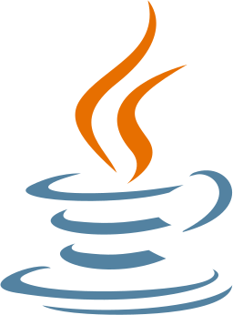
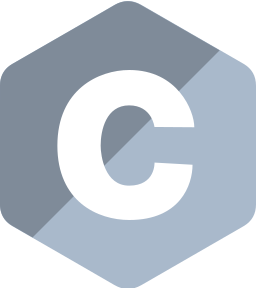
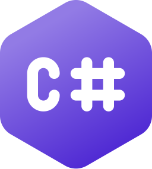
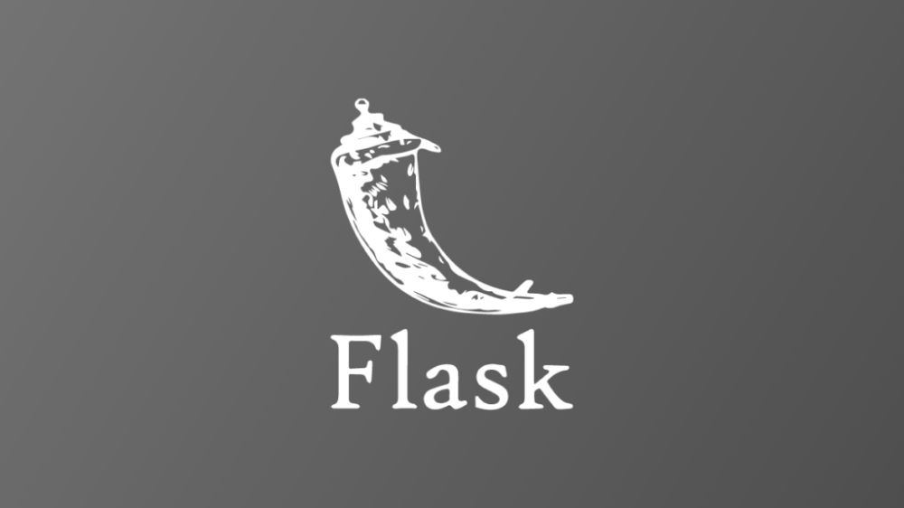
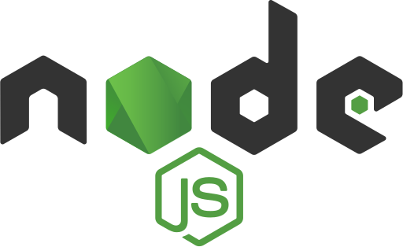
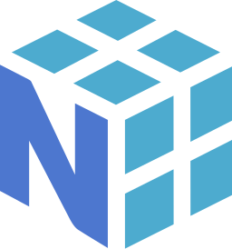
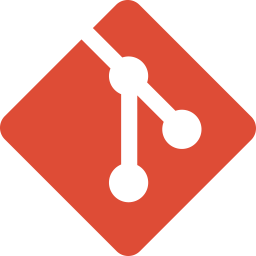

  

## 👋 Hi, I'm Yi-Chen

## 🧠 About Me
- 💻 I'm a software engineer with a passion for building scalable backend systems.
- ☁️ Enthusiastic about cloud technologies, APIs, databases, and infrastructure automation.
- 🚀 I enjoy designing reliable backend services and exploring DevOps practices.
- 🛠️ Currently working with Django, Flask, Node.js, PostgreSQL, and cloud platforms.

## 🧰 Tech Stack

### 🖥️ Programming Languages

  
  
  
  
  

### 🧱 Frameworks & Libraries

  
  
  
  
  
  

### 🗄️ Databases

  
  

### ☁️ Cloud & DevOps

  
  

### 🎨 Frontend

  
  

## 🌱 Currently Learning
- AWS/GCP fundamentals  
- Docker & CI/CD pipelines  
- Scalable system design patterns  

## 📫 Contact Me
- 📨 Email: yichen.ts15@gmail.com  
- 💼 LinkedIn: www.linkedin.com/in/yi-chen1tsai
